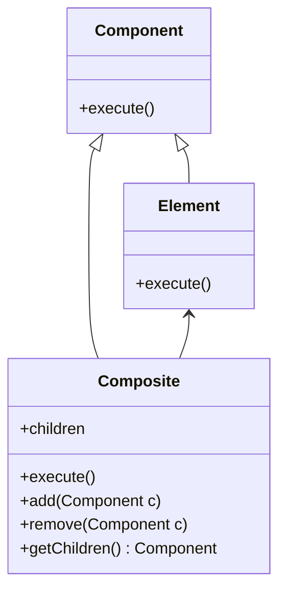
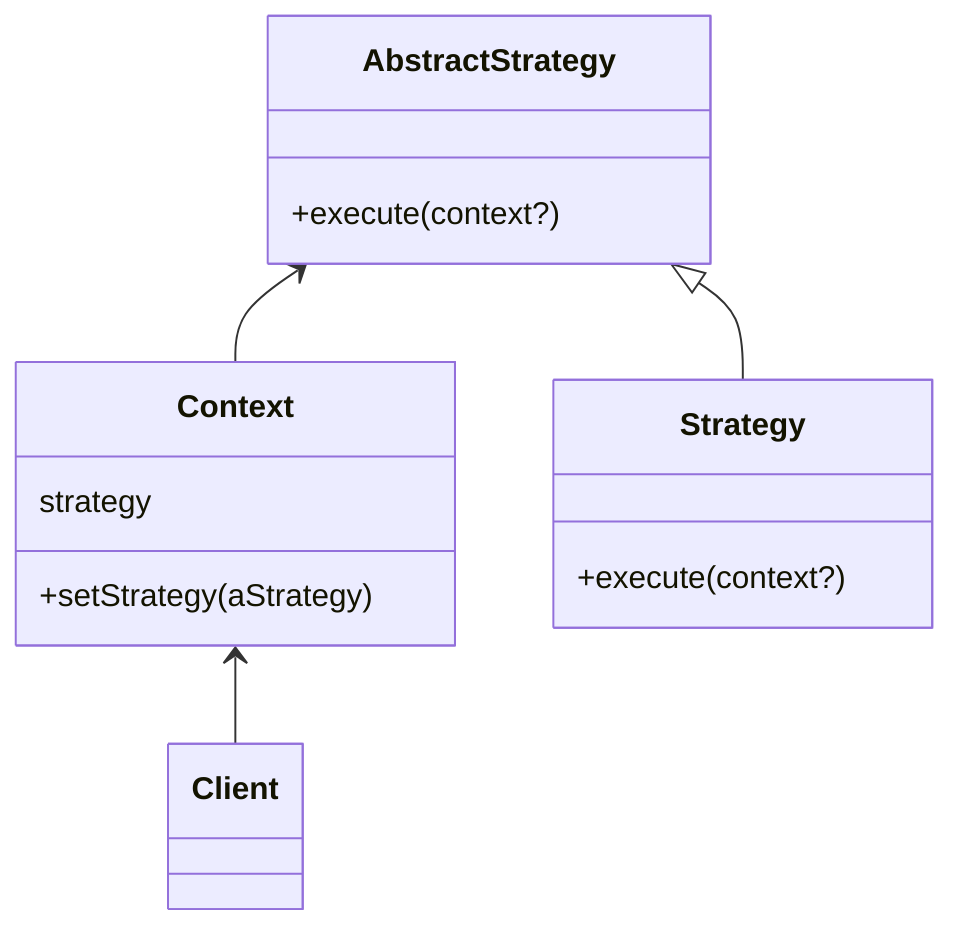
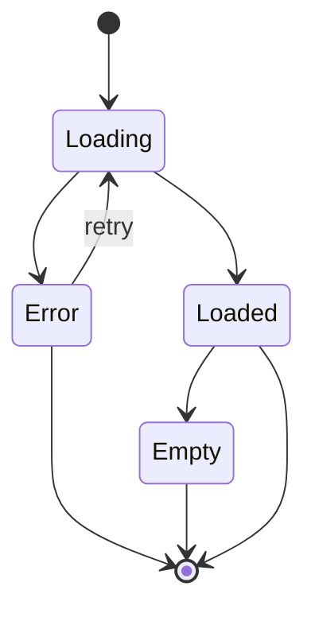
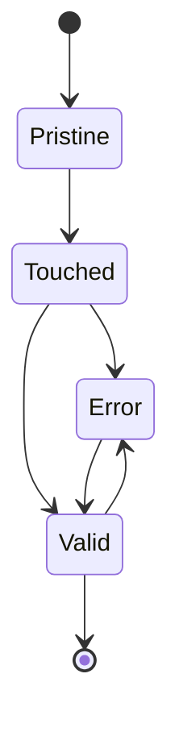
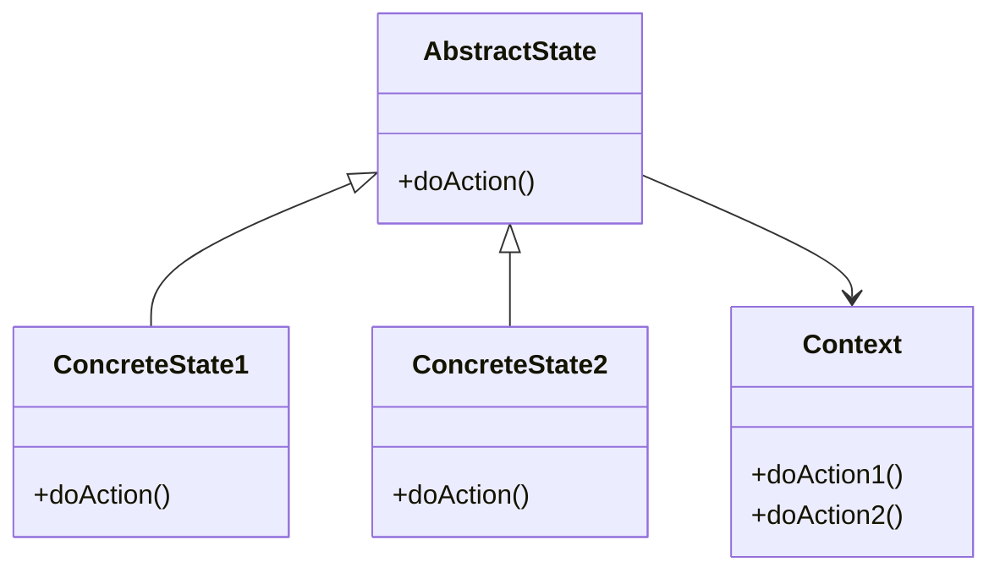
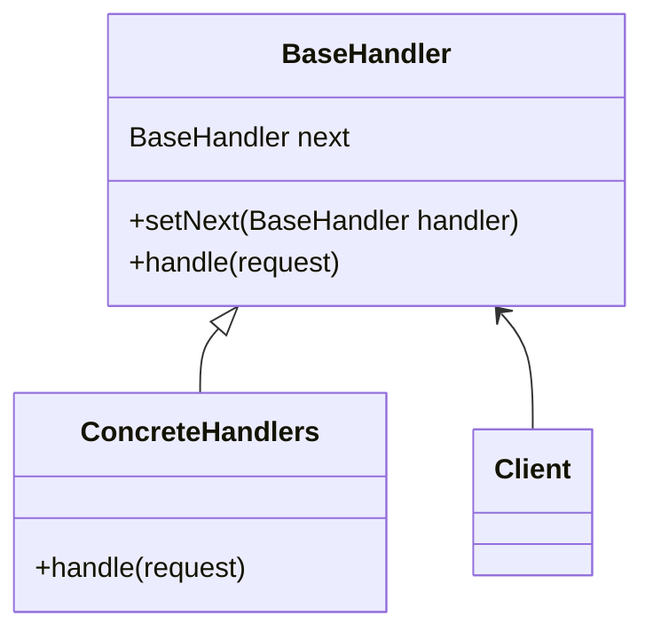

## Patrones de Diseño
Elementos reusables de diseño para resolver problemas comunes de sistemas.
---
## Conceptos relacionados

+ Herencia
+ Polimorfismo
+ Funciones de orden superior
+ SOLID

---
## Herencia

+ Entre clases
+ Entre objetos
---
  ```mermaid
classDiagram
    Animal <|-- Duck
    Animal <|-- Fish
    Animal <|-- Zebra
    Animal : +int age
    Animal : +String gender
    Animal: +isMammal()
    Animal: +mate()
    class Duck{
    +String beakColor
    +swim()
    +quack()
    }
    class Fish{
    -int sizeInFeet
    -canEat()
    }
    class Zebra{
    +bool is_wild
    +run()
    }
```
---
## Polimorfismo
La capacidad de diferentes objetos a responder al mismo mensaje de diferentes formas de acuerdo a los metodos que implementan.
```js
const anArray = new Array([1, 2, '100', true, false]);
const aMap = new Map([
['home', 100],
['away', 200],
]);
const aSet = new Set([1, 2, '100', true, false]);
anArray.forEach((element) => console.log(element.toString()));
aMap.forEach((element) => console.log(element.toString()));
aSet.forEach((element) => console.log(element.toString()));
[anArray, aMap, aSet].forEach((eachCollection) =>
eachCollection.forEach((element) => console.log(element.toString()))
);
```

---
## Funciones de orden superior

+ Funciones que toman otras funciones como parametro.
```js
const plusTen = (x) => x + 10;
[2, 3, 6, 7].map(plusTen);
const isBig = (x) => x > 1000;
[2, 30000, 6, 7666].filter(isBig);
const map2 = (collection, func) => {
  const result = [];
  for (let each of collection) {
    result.push(func(each));
  }
  return result;
};
map2([2, 3, 6, 7], plusTen);
map2([2, 3, 6, 7], (x) => x * x + 10);

```

+ Funciones que devuelven funciones como resultado.
```js
function plusCreator(x) {
  return function(y) {
    return x + y
  }
}
const plusTen2 = plusCreator(10);
const twice = f => x => f(f(x))
plusTwenty = twice(plusTen2)
        [2, 3, 6, 7].map(plusTwenty);

```
---
  ## SOLID

  + Single Responsibility
  + Open Closed
  + Liskov substitution
  + Interface segregation
  + Dependency Inversion
---
## Patrones de Diseño

Soluciones a problemas comunes que aparecen de forma repetida

Elementos reusables de diseño.

---
## Patrones - Clasificación GoF

  [Libro GoF](https://www.amazon.com/-/es/Gamma-Erich-ebook/dp/B000SEIBB8)

  + Creacion
  + Estructurales
  + Comportamiento
---
## Creacion - Factory Method

  Permite tener una forma unificada y separada para crear objetos sin especificar directamente que clase se va a usar.

```js
class Empresa extends Sector {
  createMenu() {
    return new MenuEmpresa(this);
  }
}
class GranEmpresa extends Sector {
  createMenu() {
    return new MenuEmpresa(this);
  }
}
class Individuo extends Sector {
  createMenu() {
    return new MenuIndividuo(this);
  }
}
```
factory con template
```js
class EmpresaFactory extends Sector {
  getMenu() {
    return new MenuEmpresa(this);
  }
}
class GranEmpresa extends Sector {
  getMenu() {
    return new MenuEmpresa(this);
  }
}
class Individuo extends Sector {
  getMenu() {
    return new MenuIndividuo(this);
  }
}
class Sector {
  openMenu() {
    this.createMenu().open();
  }
}

```
---
## Creacion - Singleton

  Es una clase que tiene una unica instancia.
  Se usa para modelar una clase sistema o un lugar centralizado de información.
  Tambien para no desperdiciar espacio.
```js
class Singleton {
  static instance = new Singleton();
  static getInstance() {
    return Singleton.instance;
  }
  constructor() {
    if (Singleton.instance) {
      throw new Error("there should be only one");
    }
  }
}

```
---
## Estructurales - Adapter

Se utiliza cuando tenemos que intercambiar entre dos clases que hacen lo mismo pero difieren en la interfaz.
Tipicamente usado con librerias externas
```ts
class CustomerListService {
  getCustomers() {
    return fetch("http://my-api.com/customers");
  }
}
class CustomerListComponent {
  list = [];
  constructor(service: CustomerListServiceAdapter) {}
  ngOnInit() {
    this.service
            .getCustomers()
            .suscribe((customers) => (this.list = customers));
  }
}
class CustomerListServiceAdapter {
  service;
  constructor(adaptee: CustomerListService) {
    this.service = adaptee;
  }

  getCustomers() {
    return from(
            this.service.getCustomers().then((response) => response.json())
    );
  }
}

```

```ts
export class CellComponentAdapterComponent implements OnInit {
  @Input() componentClass: Type<GridCellComponent>;
  @Input() row: any;
  @Input() index: number;
  @ViewChild("viewContainerRef", { read: ViewContainerRef, static: true })
  viewContainerRef: ViewContainerRef;
  @Input() initializer: Callback<any> = () => {};

  constructor(private componentFactoryResolver: ComponentFactoryResolver) {}

  ngOnInit() {
    if (this.componentClass) {
      const componentInstance = this.componentClass;

      const componentFactory =
              this.componentFactoryResolver.resolveComponentFactory(
                      componentInstance
              );

      const componentRef: ComponentRef<any> =
              this.viewContainerRef.createComponent(componentFactory);

      const currentComponent = componentRef.instance;

      currentComponent.rowData = this.row;

      this.initializer.call(null, currentComponent);
    }
  }
}


```
---
## Estructurales - Composite

Generalmente relacionado a una estructura de arbol con componentes y compuestos
Cada elemento individual tiene la misma interfaz que los agregados para algunas acciones
  El agregado ademas permite agregar y eliminar elementos



```ts
abstract class AbstractMenu {
  label;
  abstract render();
}
class MenuItem extends AbstractMenu {
  href: string;
  render() {
    return "<a href=${action}> ${label}</a>>";
  }
}
class Menu extends AbstractMenu {
  children: Array<AbstractMenu>;
  render() {
    const content = this.children.map((each) => each.render()).join(" ");
    return ` <div>${this.label}</div>
                 <div>${content}<div>`;
  }
  add(item) {
    this.children.push(item);
  }
}


```
---
## Composite - Ejemplos

  + Elementos del DOM
  + Arbol de componentes React / Angular
  + Arbol de componentes de cualquier UI

---
## Comportamiento - Strategy

Permite modelar diferentes comportamientos alternativos o variantes en un proceso
  Generalmente la stragy no tiene un estado y puede ser singleton



```ts
const DNI_MAXLENGTH = 11;
const CUIT_MAXLENGTH = 14;

this.loadingDocumentNumber = true;
this.service.insuredSubscription = this.strategy
        .getPersons(documentNumber)
        .subscribe({
          next: (response) => this.handleSearchResult(response),

          error: () => this.handleSearchError(),
        });

export abstract class PersonSearchDocumentTypeStrategy {
  searchControl = new FormControl(null, dniValidator.bind(this));
  pipe;
  maxlength = DNI_MAXLENGTH;
  inputMaxlength = DNI_MAXLENGTH;

  constructor(protected service: AdherentsContainerService) {}

  getPersons(documentNumber: string) {
    return this.service.getPersonsByDNI(documentNumber);
  }
}

export class PersonSearchDniStrategy extends PersonSearchDocumentTypeStrategy {
  constructor(protected service: AdherentsContainerService) {
    super(service);
  }
}

export class PersonSearchCuitStrategy extends PersonSearchDocumentTypeStrategy {
  searchControl = new FormControl(null, cuitValidator.bind(this));
  pipe = new ScCuitPipe();
  maxlength = CUIT_MAXLENGTH;
  inputMaxlength = FORMATTED_CUIT_MAXLENGTH;

  constructor(protected service: AdherentsContainerService) {
    super(service);
  }

  getPersons(documentNumber: string) {
    return this.service.getPersonByCUIT(documentNumber);
  }
}

export class PersonSearchCuitCuilStrategy extends PersonSearchCuitStrategy {}

export class PersonSearchDniCuitStrategy extends PersonSearchCuitStrategy {
  searchControl = new FormControl(null, dniCuitValidator.bind(this));
  pipe = null;
  maxlength = CUIT_MAXLENGTH;
  inputMaxlength = CUIT_MAXLENGTH;

  getPersons(documentNumber: string) {
    const number = this.service.cleanDocumentNumber(documentNumber);

    if (number.length <= DNI_MAXLENGTH) {
      return this.service.getPersonsByDNI(number);
    } else {
      return this.service.getPersonByCUIT(number);
    }
  }
}


```
---
## Strategy  - ejemplo

[Person Search List](https://dev.azure.com/sancristobalCTD/EdgETeam/_git/Portal.FE.Home?path=%2Flibs%2Fpas-common-ui%2Fsrc%2Flib%2Fcomponents%2Fperson-search-list%2Fperson-search-list.component.ts&_a=contents&version=GBmaster)
[Person Search List](https://dev.azure.com/sancristobalCTD/EdgETeam/_git/Portal.FE.Home?path=%2Flibs%2Fpas-common-ui%2Fsrc%2Flib%2Fcomponents%2Fperson-search-list%2Fperson-search-list.component.ts&_a=contents&version=GBmaster)

---
## Comportamiento - NullObject

Representar un objeto nulo con una clase en vez de con null o undefined
Permite darle un tratamiento mediante polimorfismo al caso del objeto nulo para un dominio y evitar la proliferacion de condicionales


```js
class Customer {
  name
  email
  toString(){
    return 'Nombre: ' + this.name + ' Email:' + this.email
  }
  getData() {
    return fetch('http://example.com/getCustomerData/' + this.email)
  }
}

class NullCustomer {
  toString() {
    return 'No hay cliente seleccionado'
  }
  getData() {
    return Promise.resolve({})
  }
}

```
---
## Comportamiento - State

Relacionado con una máquina de estados
Permite modificar el comportamiento de un objeto de forma dinamica de acuerdo a su estado interno






```js
class AbstractState {
  context;
  activate(request) {}
  loadData() {}
}

class LoadingState extends AbstractState {
  activate() {
    this.context.startAnimation();
    this.context.clearData();
  }
  loadData() {
    return; //do nothing
  }
}
class ErrorState extends AbstractState {
  activate() {
    this.context.stopAnimation();

    this.context.clearData();

    this.context.showErrorModal();
  }
  message() {
    return "Error";
  }
  loadData() {
    this.context.loadData();
  }
}
class LoadedState extends AbstractState {
  activate() {
    this.context.stopAnimation();

    this.context.showData();
  }
  loadData() {
    this.context.loadData();
  }
  message() {
    return "Loaded succesfully";
  }
}

class EmptyState extends AbstractState {
  activate() {
    this.context.stopAnimation();

    this.context.showEmptyImage();
  }
  loadData() {
    this.context.loadData();
  }
  message() {
    return "Loaded succesfully but no data";
  }
}


```

---
## Comportamiento - Chain of responsibility

Una secuencia de objetos tratan de manejar una solicitud.
Permite definir con flexibilidad una secuenta de comportamientos o comporobaciones mediante una cadena


```js
abstract class AbstractHandler {
  next: AbstractHandler;
  abstract handle(request);
  setNext(handler: AbstractHandler);
}
class LogHandler extends AbstractHandler {
  handle(request) {
    console.log(request);

    this.doSomethingAndContinue();

    return this.next.handle(request);
  }
}
class TerminalHandler extends AbstractHandler {
  handle(request) {
    return this.doSomethingAndCutTheChain();
  }
}

```


---
## Chain of responsibility - Ejemplo

+ HttpInteceptors de angular
+ Handlers de express
+ Pipe de un observable
+ Bubbling de eventos en el DOM
+ [Asegurados](https://dev.azure.com/sancristobalCTD/EdgETeam/_git/portalasegurado-web-autogestion?path=/src/app/shared/models/claim-group/abstract-claim-group-handler.ts&_a=contents&version=GBmaster)
